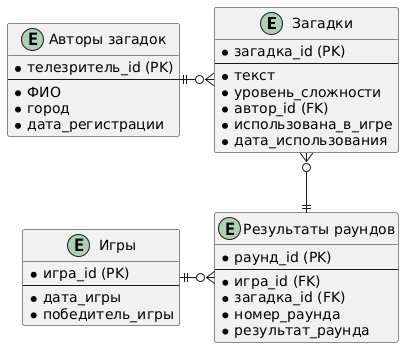

# Логическая модель данных для системы управления игрой в загадки

Этот документ описывает логическую модель данных для анализа эффективности телевизионной игры в загадки.

## Цели и бизнес-требования
- Анализ, какие загадки чаще угадываются/не угадываются.
- Определение дат, когда игры проходят наиболее успешно.
- Оценка популярности уровней сложности у телезрителей.
- Подсчет процента отклоненных загадок.

## Сущности и атрибуты

### 1. Загадки
- **загадка_id**: Уникальный идентификатор (PK).
- **текст**: Формулировка загадки.
- **уровень_сложности**: Простая, средняя, сложная.
- **автор_id**: Идентификатор телезрителя (FK).
- **использована_в_игре**: Флаг участия в играх (булевый).
- **дата_использования**: Дата участия в игре.
- **дата_подачи**: Дата внесения загадки в базу данных.

### 2. Авторы загадок
- **телезритель_id**: Уникальный идентификатор (PK).
- **ФИО**: Имя автора.
- **город**: Город автора.
- **дата_регистрации_заявки**: Дата подачи заявки.

### 3. Игры
- **игра_id**: Уникальный идентификатор (PK).
- **дата_игры**: Дата проведения игры.

### 4. Результаты раундов
- **результат_id**: Уникальный идентификатор (PK).
- **игра_id**: Идентификатор игры (FK).
- **номер_раунда**: Номер раунда в игре.
- **результат_раунда**: Победитель ("игроки" или "телезрители").

## Требования к агрегации данных
База данных должна поддерживать:
- Анализ по датам проведения игр.
- Группировку по уровням сложности загадок.
- Анализ результатов игр (победа игроков/телезрителей).
- Отслеживание активности авторов (частота использования их загадок).

