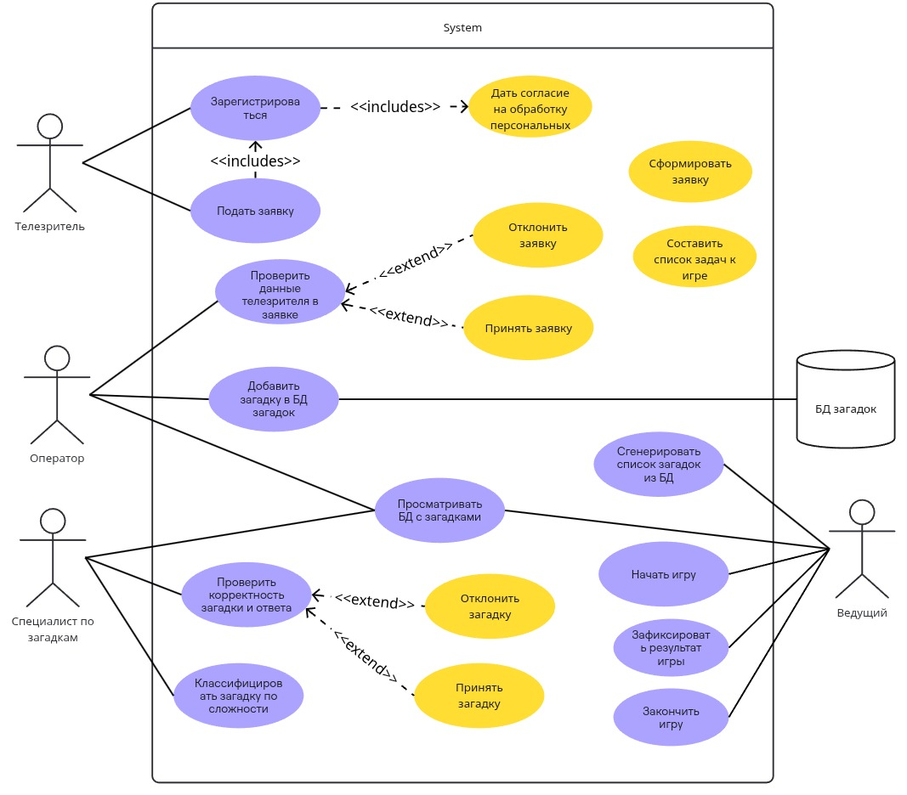

# Функциональная модель системы управления игрой в загадки

Этот документ описывает функциональную модель системы в виде текстовой интерпретации Use Case диаграммы, отражающей взаимодействие пользователей с системой.

## Актеры
- **Телезритель**: Подает заявки с загадками.
- **Оператор**: Проверяет данные телезрителей и сохраняет заявки.
- **Специалист по загадкам**: Проверяет формулировку и классифицирует загадки по сложности.
- **Ведущий**: Проводит игру, задает загадки и начисляет баллы.
- **Система**: Автоматизирует обработку заявок, выбор загадок и хранение данных.

## Use Case
1. **Подача заявки (Телезритель)**:
   - Телезритель заполняет форму с текстом загадки, ответом и персональными данными.
   - Система проверяет наличие согласия на обработку данных.
2. **Проверка данных заявки (Оператор)**:
   - Оператор анализирует данные телезрителя на корректность.
   - Система сохраняет заявку со статусом "Новая".
3. **Проверка формулировки загадки (Специалист по загадкам)**:
   - Специалист оценивает ясность и логику загадки.
   - При необходимости запрашивает уточнения у телезрителя.
4. **Классификация загадки (Специалист по загадкам)**:
   - Специалист определяет уровень сложности (простая, средняя, сложная).
   - Система сохраняет классифицированную загадку.
5. **Подготовка списка загадок (Система)**:
   - Система выбирает 13 загадок (4 простых, 4 средних, 4 сложных, 1 случайной сложности) для игры.
6. **Проведение игры (Ведущий)**:
   - Ведущий получает список загадок от системы.
   - Задает загадки участникам и начисляет баллы.
7. **Завершение игры (Ведущий, Система)**:
   - Ведущий фиксирует достижение 7 очков одной из команд.
   - Система сохраняет результаты игры и обновляет данные о загадках.

## Примечания
- Все взаимодействия с системой осуществляются через защищенное соединение (TLS 2.0).
- Система поддерживает двухфакторную аутентификацию для всех пользователей.

