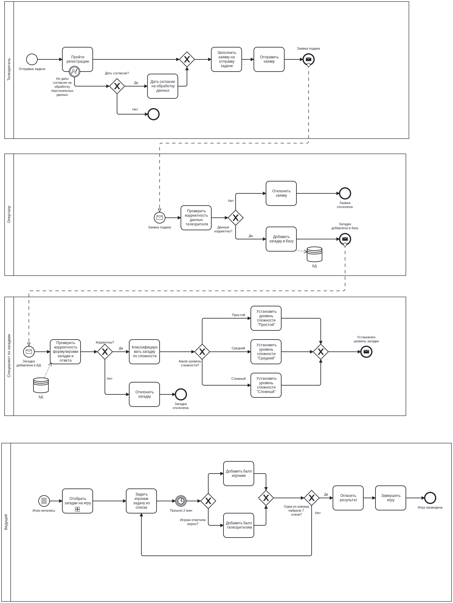

# Модель процессов для системы управления игрой в загадки

Этот документ описывает модель бизнес-процессов для управления жизненным циклом загадок в телевизионной игре.

## Границы проекта
- Прием и проверка заявок от телезрителей на добавление загадок.
- Классификация и сохранение загадок в базе данных.
- Подготовка и проведение игры ведущим с использованием загадок.
- Завершение игры при достижении одной из команд 7 очков.

## Ожидаемые результаты
- **Общий результат**: Успешное проведение телевизионной игры с использованием проверенных и классифицированных загадок, определение победителя (команда с 7 очками).
- **Промежуточные результаты**:
  - Обработана заявка телезрителя (принята/отклонена).
  - Добавление новых загадок в базу данных.
  - Классификация загадок по уровню сложности.
  - Завершение игры с фиксацией итогов.

## Основные задачи и исполнители
1. **Проверка корректности данных телезрителя**  
   - Задача: Анализ данных заявки на ошибки.  
   - Исполнитель: Оператор.
2. **Добавление загадки в базу**  
   - Задача: Сохранение проверенной загадки.  
   - Исполнитель: Оператор (с участием системы).
3. **Проверка корректности формулировки загадки**  
   - Задача: Оценка ясности и логики загадки.  
   - Исполнитель: Специалист по загадкам.
4. **Классификация загадки по сложности**  
   - Задача: Определение уровня сложности (простая, средняя, сложная).  
   - Исполнитель: Специалист по загадкам.
5. **Заполнение и отправка заявки**  
   - Задача: Подготовка и отправка новой заявки с формулировкой задачи и ответа.  
   - Исполнитель: Телезритель.
6. **Проверка согласия на обработку данных**  
   - Задача: Автоматическая проверка наличия согласия.  
   - Исполнитель: Система.
7. **Сохранение заявки**  
   - Задача: Хранение заявки со статусом "Новая".  
   - Исполнитель: Система.
8. **Подготовка списка задач**  
   - Задача: Выбор и добавление задач в игровой список.  
   - Исполнитель: Система.
9. **Задание задачи игрокам**  
   - Задача: Передача загадки участникам.  
   - Исполнитель: Ведущий.
10. **Начисление баллов**  
    - Задача: Обновление счета игроков и телезрителей.  
    - Исполнитель: Ведущий (с поддержкой системы).
11. **Завершение игры**  
    - Задача: Окончание игры при достижении 7 очков.  
    - Исполнитель: Ведущий.

## Диаграмма процессов

